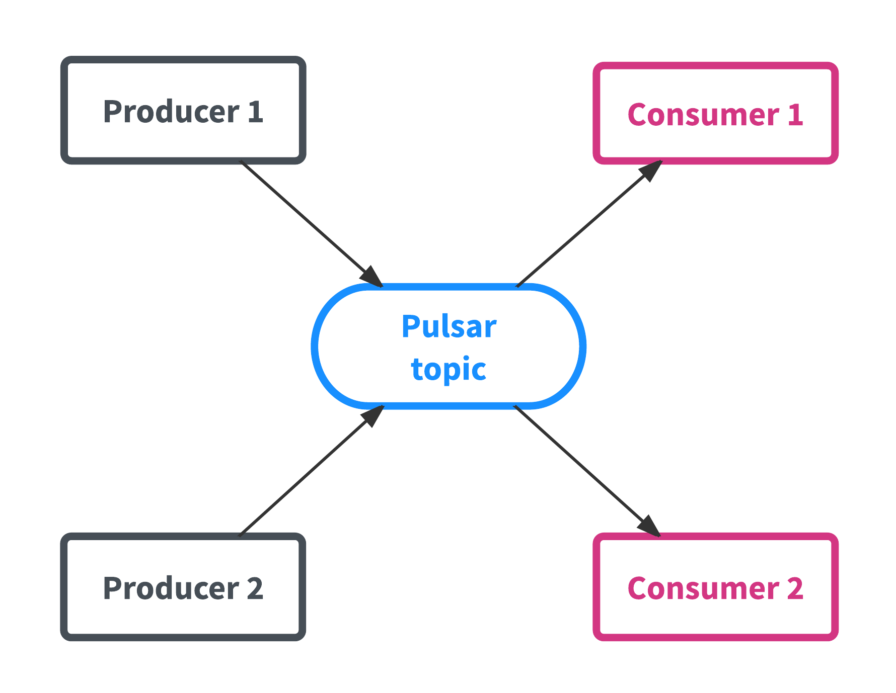
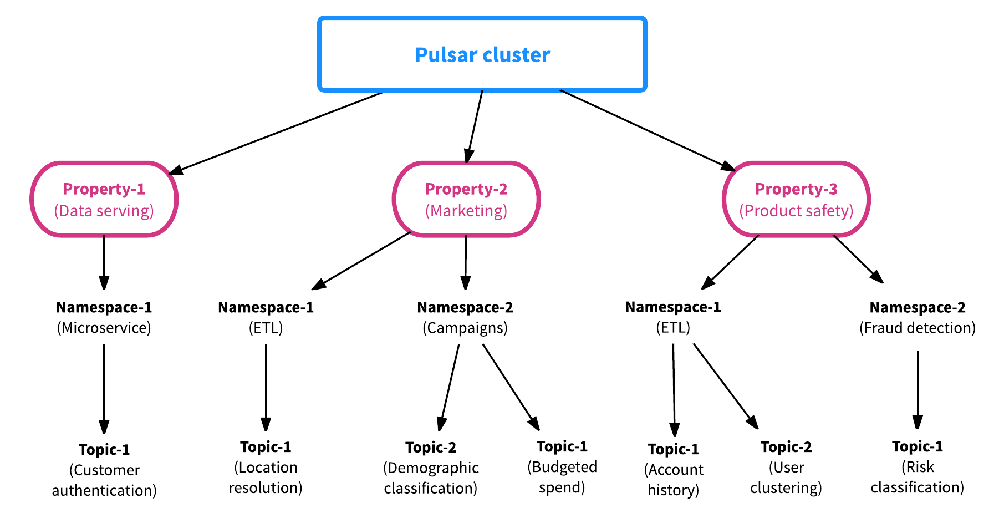
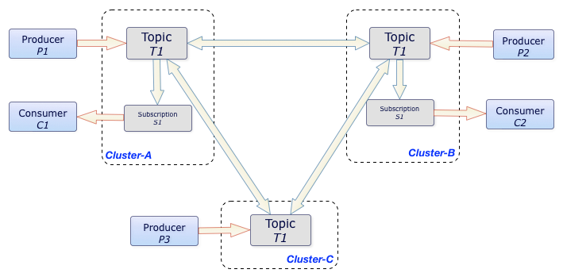

# Pulsar

## 简介

1. Pulsar是pub-sub模式的分布式消息平台，拥有灵活的消息模型和直观的客户端API。
2. Pulsar由雅虎开发并开源的下一代消息系统，目前是Apache软件基金会的项目。
3. 最新版本是2.2.0
  

  
## 架构

## 基本概念

#### Topic, Tenant, Namespace, Partition

Topic是Pulsar的核心概念，表示一个`channel`，Producer可以写入数据，Consumer从中消费数据  
Topic名称的url类似如下的结构：  

`{persistent|non-persistent}://tenant/namespace/topic`

* persistent|non-persistent表示数据是否持久化（Pulsar支持消息持久化和非持久化两种模式）
* Tenant为租户
* Namespace一般聚合一系列相关的Topic，一个租户下可以有多个Namespace
* 默认值: 当一个topic不指明url时, 比如topic为`chart`, 那么默认的url为`persistent://public/default/chart`
  
如图所示:  
    

  
上图中Property即为租户，每个租户下可以有多个Namespace，每个Namespace下有多个Topic。  
Namespace是Pulsar中的操作单元，包括Topic是配置在Namespace级别的，包括多地域复制，消息过期策略等都是配置在Namespace上的。  
  
为了解决分区问题Pulsar和kafka类似采取了分区机制  
  

  
Pulsar提供了一些策略来处理消息到Partition的路由（MessageRouter）：  
  
* Single partitioning：Producer随机选择一个Partition并将所有消息写入到这个分区
* Round robin partitioning ：采用Round robin的方式，轮训所有分区进行消息写入
* Hash partitioning：这种模式每条消息有一个Key，Producer根据消息的Key的哈希值进行分区的选择（Key相同的消息可以保证顺序）。
* Custom partitioning：用户自定义路由策略  
  
不同于Kafka，Pulsar允许Consumer的数量超过分区的数量  
在Shared subscription的订阅模式下，Consumer数量可以大于分区的数量，每个Consumer处理每个Partition中的一部分消息，不保证消息的顺序。

#### 订阅模型
  
Pulsar提供了灵活的消息模型，支持三种订阅类型：
  
* Exclusive subscription：排他的，只能有一个Consumer，接收一个Topic所有的消息
* Shared subscription：共享的，可以同时存在多个Consumer，每个Consumer处理Topic中一部消息（Shared模型是不保证消息顺序的，Consumer数量可以超过分区的数量）
* Failover subscription：Failover模式，同一时刻只有一个有效的Consumer，其余的Consumer作为备用节点，在Master Consumer不可用后进行替代（看起来适用于数据量小，且解决单点故障的场景）

  
#### Broker, Bookie
  

  
Pulsar采用"存储和服务分离"的两层架构（这是Pulsar区别于其他MQ系统最重要的一点，也是所谓的"下一代消息系统"的核心）：  

* Broker：提供发布和订阅的服务（Pulsar的组件）
* Bookie：提供存储能力（BookKeeper的存储组件）
优势是Broker成为了stateless组件，可以水平扩容。高可靠，一致性等通过BookKeeper去保证。  

#### Geo-replication
  

  
上图中，Producer P1、P2、P3在不同的Cluster发送给Topic T1的消息，会在Cluster之间进行复制，Consumer C1、C2可以在自己所在的Cluster消费到所有的消息。
当消息被写入Pulsar时，首先消息被持久化在local cluster，之后异步的发送到其他cluster。在没有链接问题的情况下，通常复制的latency相近于网络的RTT。

#### Pulsar function, Pulsar IO, Pulsar SQL

Pulsar function  
  

Pulsar IO

  
|Name	| Java Class	| 
|-------|---------------|
| Aerospike sink	| org.apache.pulsar.io.aerospike.AerospikeSink |
| Cassandra sink	| org.apache.pulsar.io.cassandra.CassandraSink |
| Kafka source	|org.apache.pulsar.io.kafka.KafkaSource |
| Kafka sink	|org.apache.pulsar.io.kafka.KafkaSink |
| Kinesis sink	|org.apache.pulsar.io.kinesis.KinesisSink |
| RabbitMQ source	|org.apache.pulsar.io.rabbitmq.RabbitMQSource |
| Twitter Firehose source	|org.apache.pulsar.io.twitter.TwitterFireHose |
