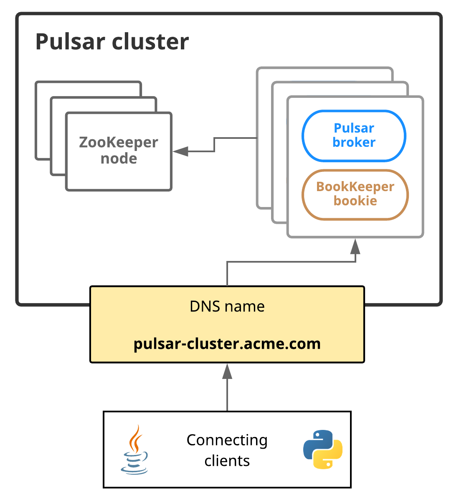
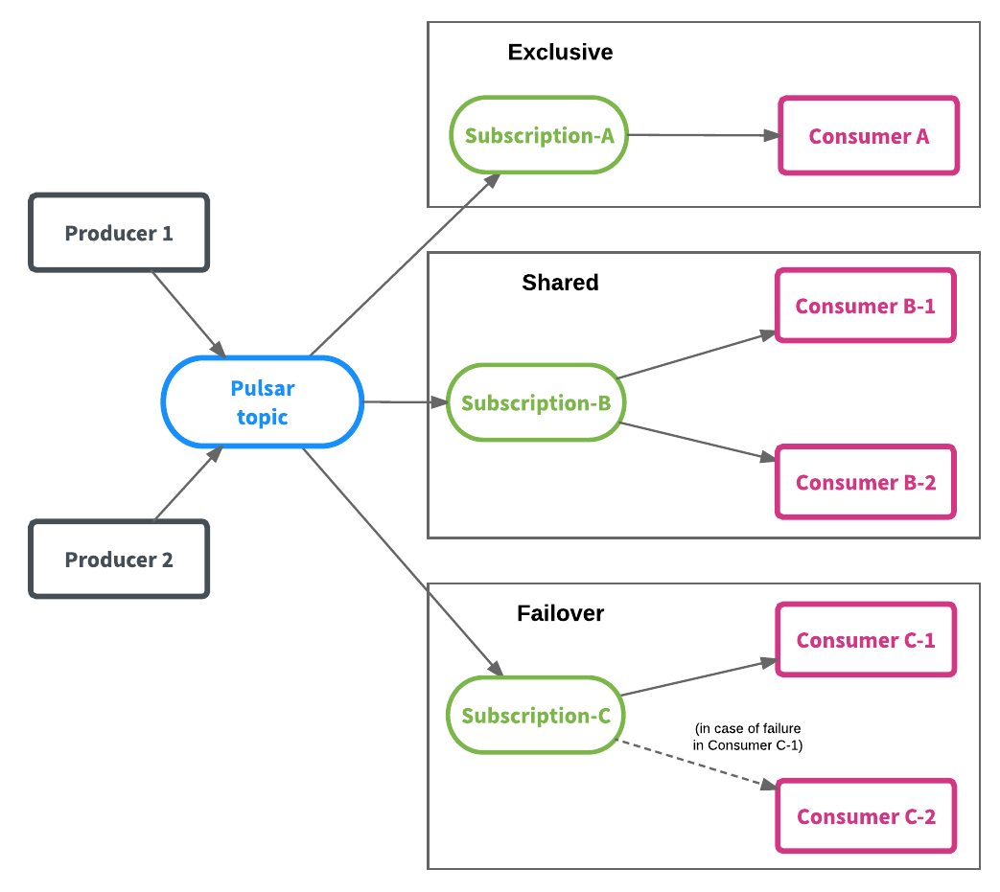
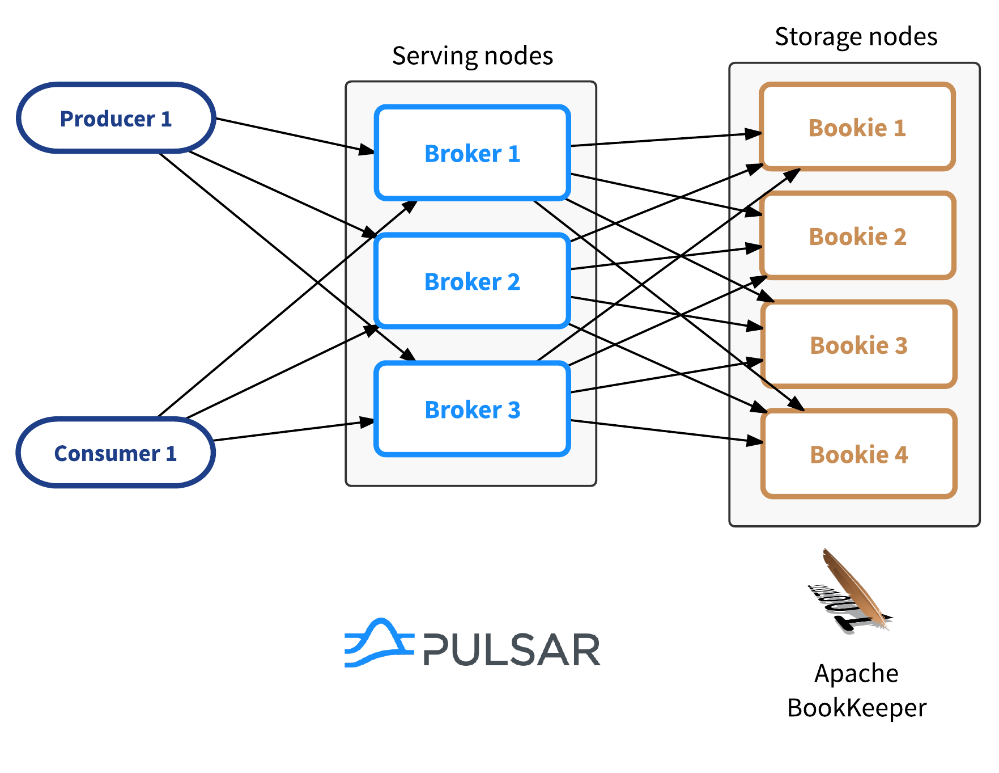
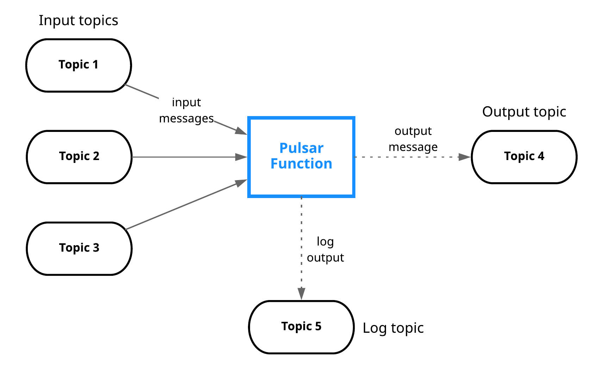
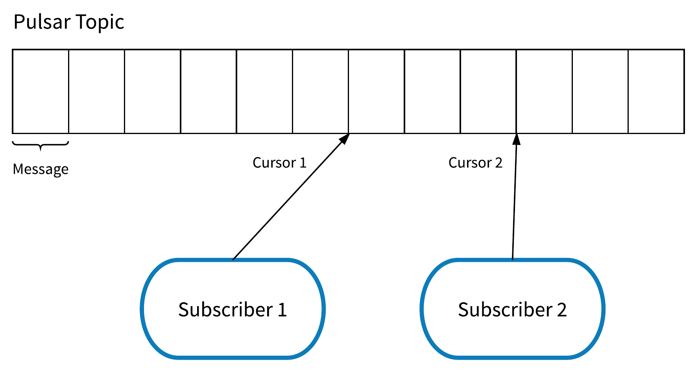
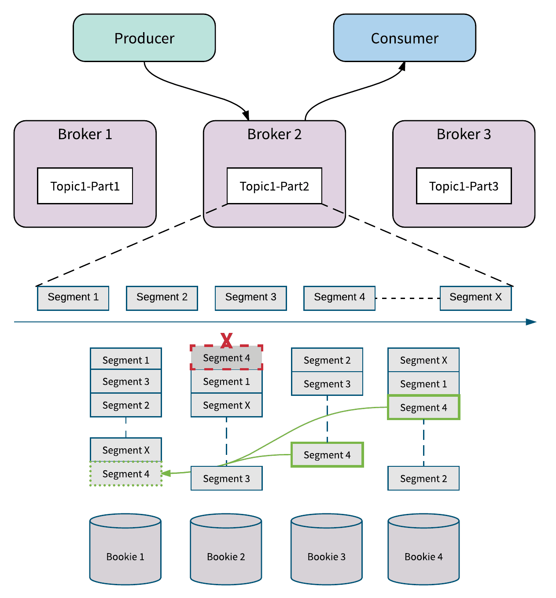

# Pulsar

# 简介

1. Pulsar是pub-sub模式的分布式消息平台，拥有灵活的消息模型和直观的客户端API。
2. Pulsar由雅虎开发并开源的下一代消息系统，目前是Apache软件基金会的项目。
3. 最新版本是2.2.0
  

  
# 架构




# 基本概念

## Topic, Tenant, Namespace, Partition

Topic是Pulsar的核心概念，表示一个`channel`，Producer可以写入数据，Consumer从中消费数据  
Topic名称的url类似如下的结构：  

`{persistent|non-persistent}://tenant/namespace/topic`

* persistent|non-persistent表示数据是否持久化（Pulsar支持消息持久化和非持久化两种模式）
* Tenant为租户
* Namespace一般聚合一系列相关的Topic，一个租户下可以有多个Namespace
* 默认值: 当一个topic不指明url时, 比如topic为`chart`, 那么默认的url为`persistent://public/default/chart`
  
如图所示:  
    

  
上图中Property即为租户，每个租户下可以有多个Namespace，每个Namespace下有多个Topic。  
Namespace是Pulsar中的操作单元，包括Topic是配置在Namespace级别的，包括多地域复制，消息过期策略等都是配置在Namespace上的。  
  
为了解决分区问题Pulsar和kafka类似采取了分区机制  
  

  
Pulsar提供了一些策略来处理消息到Partition的路由（MessageRouter）：  
  
* Single partitioning：Producer随机选择一个Partition并将所有消息写入到这个分区
* Round robin partitioning ：采用Round robin的方式，轮训所有分区进行消息写入
* Hash partitioning：这种模式每条消息有一个Key，Producer根据消息的Key的哈希值进行分区的选择（Key相同的消息可以保证顺序）。
* Custom partitioning：用户自定义路由策略  
  
不同于Kafka，Pulsar允许Consumer的数量超过分区的数量  
在Shared subscription的订阅模式下，Consumer数量可以大于分区的数量，每个Consumer处理每个Partition中的一部分消息，不保证消息的顺序。

## 订阅模型
  
Pulsar提供了灵活的消息模型，支持三种订阅类型：
  
* Exclusive subscription：排他的，只能有一个Consumer，接收一个Topic所有的消息
* Shared subscription：共享的，可以同时存在多个Consumer，每个Consumer处理Topic中一部消息（Shared模型是不保证消息顺序的，Consumer数量可以超过分区的数量）
* Failover subscription：Failover模式，同一时刻只有一个有效的Consumer，其余的Consumer作为备用节点，在Master Consumer不可用后进行替代（看起来适用于数据量小，且解决单点故障的场景）


  
## Broker, Bookie
  

  
Pulsar采用"存储和服务分离"的两层架构（这是Pulsar区别于其他MQ系统最重要的一点，也是所谓的"下一代消息系统"的核心）：  

* Broker：提供发布和订阅的服务（Pulsar的组件）
* Bookie：提供存储能力（BookKeeper的存储组件）
优势是Broker成为了stateless组件，可以水平扩容。高可靠，一致性等通过BookKeeper去保证。  

## Geo-replication
  

  
上图中，Producer P1、P2、P3在不同的Cluster发送给Topic T1的消息，会在Cluster之间进行复制，Consumer C1、C2可以在自己所在的Cluster消费到所有的消息。
当消息被写入Pulsar时，首先消息被持久化在local cluster，之后异步的发送到其他cluster。在没有链接问题的情况下，通常复制的latency相近于网络的RTT。

## Pulsar function, Pulsar IO, Pulsar SQL

### Pulsar function  
  


### Pulsar IO


  
|Name	| Java Class	| 
|-------|---------------|
| Aerospike sink	| org.apache.pulsar.io.aerospike.AerospikeSink |
| Cassandra sink	| org.apache.pulsar.io.cassandra.CassandraSink |
| Kafka source	|org.apache.pulsar.io.kafka.KafkaSource |
| Kafka sink	|org.apache.pulsar.io.kafka.KafkaSink |
| Kinesis sink	|org.apache.pulsar.io.kinesis.KinesisSink |
| RabbitMQ source	|org.apache.pulsar.io.rabbitmq.RabbitMQSource |
| Twitter Firehose source	|org.apache.pulsar.io.twitter.TwitterFireHose |

### Pulsar SQL

```java  
./bin/pulsar standalone
./bin/pulsar sql-worker run
./bin/pulsar sql

presto> select * from pulsar."public/default".topic1;

  firstname  | middlename  |  lastname   |              email               |   username   | password | telephonenumber | age |                 companyemail                  | nationalidentitycardnumber | 
-------------+-------------+-------------+----------------------------------+--------------+----------+-----------------+-----+-----------------------------------------------+----------------------------+
 Genesis     | Katherine   | Wiley       | genesis.wiley@gmail.com          | genesisw     | y9D2dtU3 | 959-197-1860    |  71 | genesis.wiley@interdemconsulting.eu           | 880-58-9247                |   
 Brayden     |             | Stanton     | brayden.stanton@yahoo.com        | braydens     | ZnjmhXik | 220-027-867     |  81 | brayden.stanton@supermemo.eu                  | 604-60-7069                |   
 Benjamin    | Julian      | Velasquez   | benjamin.velasquez@yahoo.com     | benjaminv    | 8Bc7m3eb | 298-377-0062    |  21 | benjamin.velasquez@hostesltd.biz              | 213-32-5882                |   
 Michael     | Thomas      | Donovan     | donovan@mail.com                 | michaeld     | OqBm9MLs | 078-134-4685    |  55 | michael.donovan@memortech.eu                  | 443-30-3442                |   
 Brooklyn    | Avery       | Roach       | brooklynroach@yahoo.com          | broach       | IxtBLafO | 387-786-2998    |  68 | brooklyn.roach@warst.biz                      | 085-88-3973                |   
 Skylar      |             | Bradshaw    | skylarbradshaw@yahoo.com         | skylarb      | p6eC6cKy | 210-872-608     |  96 | skylar.bradshaw@flyhigh.eu                    | 453-46-0334                |    
.
.
.

```

对于嵌套结构的schema

```java  

public static class Test {
        private String name;
        private Profile profile;
        public String getName() {
            return name;
        }
        public void setName(String name) {
            this.name = name;
        }
        public Profile getProfile() {
            return profile;
        }
        public void setProfile(Profile profile) {
            this.profile = profile;
        }
    }
    
    public static class Profile {
        private int age;
        private String address;
        public int getAge() {
            return age;
        }
        public void setAge(int age) {
            this.age = age;
        }
        public String getAddress() {
            return address;
        }
        public void setAddress(String address) {
            this.address = address;
        }
    }
```

```java  
  name   | profile.age | profile.address | __event_time__ |      __publish_time__       | __message_id__ | __sequence_id__ | __producer_name
---------+-------------+-----------------+----------------+-----------------------------+----------------+-----------------+----------------
 name100 |         100 | address100      | NULL           | 2018-11-01 07:13:32.645 UTC | 1219:100:-1:0  |             100 | producer-demo
 name101 |         101 | address101      | NULL           | 2018-11-01 07:13:32.650 UTC | 1219:101:-1:0  |             101 | producer-demo
 name102 |         102 | address102      | NULL           | 2018-11-01 07:13:32.654 UTC | 1219:102:-1:0  |             102 | producer-demo
 name103 |         103 | address103      | NULL           | 2018-11-01 07:13:32.658 UTC | 1219:103:-1:0  |             103 | producer-demo
 name104 |         104 | address104      | NULL           | 2018-11-01 07:13:32.662 UTC | 1219:104:-1:0  |             104 | producer-demo
 name105 |         105 | address105      | NULL           | 2018-11-01 07:13:32.666 UTC | 1219:105:-1:0  |             105 | producer-demo
 name106 |         106 | address106      | NULL           | 2018-11-01 07:13:32.677 UTC | 1219:106:-1:0  |             106 | producer-demo
 name107 |         107 | address107      | NULL           | 2018-11-01 07:13:32.681 UTC | 1219:107:-1:0  |             107 | producer-demo
 name108 |         108 | address108      | NULL           | 2018-11-01 07:13:32.685 UTC | 1219:108:-1:0  |             108 | producer-demo
 name109 |         109 | address109      | NULL           | 2018-11-01 07:13:32.689 UTC | 1219:109:-1:0  |             109 | producer-demo
 name110 |         110 | address110      | NULL           | 2018-11-01 07:13:32.695 UTC | 1219:110:-1:0  |             110 | producer-demo

```

# 细节

### 集群创建

集群环境的最小要求  
6 台 linux 机器或虚拟机  
其中  
3台zookeeper集群  
3台pulsar broker与bookie  
1台service discovery(可选)  

推荐的硬件配置

zookeeper略  
Bookies & Brokers  
高速cpu以及高速网卡(10Gbps), SSD或HDDs  

```java  

# zookeeper集群略
# zk1.example.com:2181,zk2.example.com:2181,zk3.example.com:2181

# pulsar
wget https://archive.apache.org/dist/pulsar/pulsar-2.2.0/apache-pulsar-2.2.0-bin.tar.gz
tar xvzf apache-pulsar-2.2.0-bin.tar.gz
cd apache-pulsar-2.2.0

# 写入集群的metadata到zookeeper
bin/pulsar initialize-cluster-metadata \
  --cluster pulsar-cluster-1 \
  --zookeeper zk1.example.com:2181 \
  --configuration-store zk1.example.com:2181 \
  --web-service-url http://pulsar.example.com:8080 \
  --web-service-url-tls https://pulsar.example.com:8443 \
  --broker-service-url pulsar://pulsar.example.com:6650 \
  --broker-service-url-tls pulsar+ssl://pulsar.example.com:6651

# Bookie cluster
# conf/bookkeeper.conf
# zkServers=zk1.example.com:2181,zk2.example.com:2181,zk3.example.com:2181
bin/pulsar-daemon start bookie

# Broker cluster
# conf/broker.conf
# zookeeperServers=zk1.example.com:2181,zk2.example.com:2181,zk3.example.com:2181
# configurationStoreServers=zk1.example.com:2181,zk2.example.com:2181,zk3.example.com:2181
# clusterName=pulsar-cluster-1
# functionsWorkerEnabled=true(可选)
# pulsarFunctionsCluster=pulsar-cluster-1(可选)
bin/pulsar broker

# Service discovery
# conf/discovery.conf
# zookeeperServers=zk1.example.com:2181,zk2.example.com:2181,zk3.example.com:2181
# configurationStoreServers=zk1.example.com:2181,zk2.example.com:2181,zk3.example.com:2181
bin/pulsar-daemon start discovery

```

### Namespace创建

```java  

bin/pulsar-admin tenants create -c pulsar-cluster-1 nextop
bin/pulsar-admin namespaces create -c pulsar-cluster-1 nextop/gondor

```
  
### 客户端编程

```java  
<dependency>
  <groupId>org.apache.pulsar</groupId>
  <artifactId>pulsar-client</artifactId>
  <version>2.2.0</version>
</dependency>
```

#### Producer

```java  

PulsarClient client = PulsarClient.builder()
        .serviceUrl("pulsar://pulsar.example.com:6650").build();
Producer<byte[]> producer = client.newProducer()
        .topic("my-topic") // persistent://public/default/my-topic
        .batchingMaxPublishDelay(10, TimeUnit.MILLISECONDS) // optional
        .sendTimeout(10, TimeUnit.SECONDS) // optional
        .blockIfQueueFull(true) // optional
        .create();

producer.send("My message".getBytes());
// producer.sendAsync("My message".getBytes());

// send messages with properties.
producer.newMessage()
    .key("my-message-key")
    .value("my-async-message".getBytes())
    .property("my-key", "my-value")
    .property("my-other-key", "my-other-value")
    .send();

// close
producer.close();
client.close();

// async close
// producer.closeAsync();
// client.closeAsync();

```

#### Consumer

```java  

PulsarClient client = PulsarClient.builder()
        .serviceUrl("pulsar://pulsar.example.com:6650").build();
Consumer consumer = client.newConsumer()
        .topic("my-topic")
        .subscriptionName("my-subscription")
        .ackTimeout(10, TimeUnit.SECONDS)
        .subscriptionType(SubscriptionType.Exclusive)
        .subscribe();
        
while (true) {
    Message msg = consumer.receive();
    System.out.printf("Message received: %s", new String(msg.getData()));
    consumer.acknowledge(msg);
    // consumer.acknowledgeCumulative(message); // cumulative acknowledge
} 


// async receive
CompletableFuture<Message> asyncMessage = consumer.receiveAsync();

```
  
订阅多个topics  
  
```java  
PulsarClient client = PulsarClient.builder()
        .serviceUrl("pulsar://pulsar.example.com:6650").build();
        
// Pattern pattern = Pattern.compile("persistent://public/default/.*");
Pattern pattern = Pattern.compile("persistent://public/default/foo.*");

Consumer allTopicsConsumer = client.newConsumer()
        .subscriptionName("my-subscription")
        .topicsPattern(pattern)
        //.topics(Arrays.asList("topic1", "topic2"))
        .subscribe();

```

#### Reader

```java  
PulsarClient client = PulsarClient.builder()
        .serviceUrl("pulsar://pulsar.example.com:6650").build();
        
ReaderConfiguration conf = new ReaderConfiguration();
Reader reader = client.newReader()
        .topic(topic)
        .startMessageId(MessageId.fromByteArray(msgIdBytes))
        //.startMessageId(MessageId.latest)
        //.startMessageId(MessageId.earliest)
        .create();

while (true) {
    Message message = reader.readNext();
    // Process message
}

// reader不能用在partitioned topic上

```

#### Consumer与Reader的区别


#### Schema

```java  

Producer<byte[]> bytesProducer = client.newProducer()
      .topic("some-raw-bytes-topic")
      .create();
// 等同于
Producer<byte[]> bytesProducer = client.newProducer(Schema.BYTES)
      .topic("some-raw-bytes-topic")
      .create();
      
public class SensorReading {
    public float temperature;

    public SensorReading() {
    }

    public float getTemperature() {
        return temperature;
    }

    public void setTemperature(float temperature) {
        this.temperature = temperature;
    }
}

Producer<SensorReading> producer = client.newProducer(JSONSchema.of(SensorReading.class))
        .topic("sensor-readings")
        .create();
        
SensorReading message = new SensorReading();
message.setTemperature(32.5f);
producer.send(message);

```

Pulsar内嵌的Schema  
  
* STRING
* BYTES
* JSON
* Protobuf
* Avro
* ByteSchema.of()
* ShortSchema.of()
* IntSchema.of()
* LongSchema.of()
* FloatSchema.of()
* DoubleSchema.of()

### 订阅模型

```java  

// default
client.newConsumer().topic("test")
    .subscriptionName("name").subscriptionType(SubscriptionType.Exclusive).subscribe(); 
    
    
client.newConsumer().topic("test")
    .subscriptionName("name").subscriptionType(SubscriptionType.Shared).subscribe();
    
client.newConsumer().topic("test")
    .subscriptionName("name").subscriptionType(SubscriptionType.Failover).subscribe();

```

#### Exclusive Mode


#### Shared


* 不保证消息顺序, 不能使用`cumulative acknowledgment`

#### Failover


* 按照`consumerName("consumer-name-1")`的字典序, 第一个consumer接受消息, 其他为slave的consumer, master断开后, 所有master未ack的消息都会被slave再次消费.

#### 多主题订阅的一些限制

1. 多主题订阅必须在相同的namespace下
2. 多主题订阅不保证消息顺序
3. 多主题订阅如果一个topic不存在时, 那么会在topic创建时自动订阅此topic

### 消息

#### 保留与过期
  
消息保留(retention) 可以额外存储一个已经acknowledgment的消息一段时间, 消息过期(expiry) 允许给一个未acknowledgment设置一个TTL. 保留与过期是在namespace级别上设置  
  

  
设置保留策略  
  
```java  
bin/pulsar-admin namespaces set-retention nextop/gondor --size 10G --time 3h
bin/pulsar-admin namespaces set-retention nextop/gondor --size 1T --time -1
bin/pulsar-admin namespaces set-retention nextop/gondor --size -1 --time -1

```
  
设置过期策略  
  
```java  
# TTL of 2 minutes
bin/pulsar-admin namespaces set-message-ttl nextop/gondor --messageTTL 120 

```
  
#### 消息去重


  
```java  

配置conf/broker.conf
brokerDeduplicationEnabled=true

bin/pulsar-admin namespaces set-deduplication nextop/gondor --enable
bin/pulsar-admin namespaces set-deduplication nextop/gondor --disable

客户端需要设置producer name以及设置sendTimeout(0, TimeUnit.SECONDS);

```

#### 消息语义

1. At-most-once

2. At-least-once

3. Exactly-once(At-least-once + Message deduplication)

#### Topic压缩

```java  
# 自动
bin/pulsar-admin namespaces set-compaction-threshold --threshold 100M nextop/gondor

# 手动
bin/pulsar compact-topic --topic persistent://nextop/gondor/my-topic

```

#### Non-persistent消息

```java  
non-persistent://nextop/gondor/topic

#conf/broker.conf
enableNonPersistentTopics=true
enablePersistentTopics=true

```

#### Partitioned topics

```java  
bin/pulsar-admin topics create-partitioned-topic persistent://nextop/gondor/topic --partitions 4

```

#### Cursors in Pulsar




### 存储

#### 存储概览

* broker无状态, metadata存储在zookeeper中


#### Broker failover and expansion


  
* 扩展broker不需要数据再平衡

#### Bookie failover and expansion
  

  
* bookie如果有failure的话需要数据再平衡
  

  
* 扩展bookie的话有可能保存的segment数量不均衡

## 未涉及到的其他主题

[Authentication](https://pulsar.apache.org/docs/en/security-tls-authentication/)
[Geo-replication](https://pulsar.apache.org/docs/en/administration-geo/)
[pulsar-IO](https://pulsar.apache.org/docs/en/io-quickstart/)
[pulsar-functions](https://pulsar.apache.org/docs/en/functions-quickstart/)
[pulsar-SQL](https://pulsar.apache.org/docs/en/sql-getting-started/)
[pulsar-dashboard](https://pulsar.apache.org/docs/en/administration-dashboard/)
[pulsar configuration](https://pulsar.apache.org/docs/en/reference-configuration/)
  
# References

* [Comparing Pulsar and Kafka: how a segment-based architecture delivers better performance, scalability, and resilience](https://streaml.io/blog/pulsar-segment-based-architecture)
* [Effectively-once semantics in Apache Pulsar](https://streaml.io/blog/pulsar-effectively-once)
* [Exactly once is NOT exactly the same](https://streaml.io/blog/exactly-once)
* [Introduction to Apache BookKeeper](https://streaml.io/blog/intro-to-bookkeeper)
* [Why Apache BookKeeper? Part 1](https://streaml.io/blog/why-apache-bookkeeper)
* [Why Apache Bookkeeper? Part 2](https://streaml.io/blog/why-bookkeeper-part-2)
* [Cursors in Apache Pulsar](https://streaml.io/blog/cursors-in-pulsar)